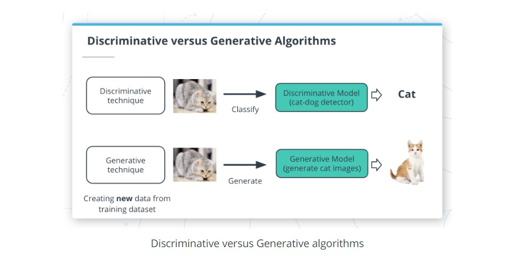

# Generative AI and Its Applications

A generative model aims to answer the question,"Have I seen data like this before?" In our image classification example, we might still use a generative model by framing the problem in terms of whether an image with the label "cat" is more similar to data you’ve seen before than an image with the label "no cat".

However, generative models can be used to support a second use case. The patterns learned in generative models can be used to create brand new examples of data which look similar to the data it seen before.

## Generative AI Models

In this lesson, you will learn how to create three popular types of generative models: **generative adversarial networks (GANs)**, **general autoregressive models**, and **transformer-based models**. Each of these is accessible through AWS DeepComposer to give you hands-on experience with using these techniques to generate new examples of music.

### Autoregressive models
Autoregressive convolutional neural networks (AR-CNNs) are used to study systems that evolve over time and assume that the likelihood of some data depends only on what has happened in the past. It’s a useful way of looking at many systems, from weather prediction to stock prediction.

### Generative adversarial networks (GANs)
Generative adversarial networks (GANs), are a machine learning model format that involves pitting two networks against each other to generate new content. The training algorithm swaps back and forth between training a generator network (responsible for producing new data) and a discriminator network (responsible for measuring how closely the generator network’s data represents the training dataset).

### Transformer-based models
Transformer-based models are most often used to study data with some sequential structure (such as the sequence of words in a sentence). Transformer-based methods are now a common modern tool for modeling natural language.

### What are GANs?

A GAN is a type of generative machine learning model which pits two neural networks against each other to generate new content: a generator and a discriminator.

- A generator is a neural network that learns to create new data resembling the source data on which it was trained.
- A discriminator is another neural network trained to differentiate between real and synthetic data.
The generator and the discriminator are trained in alternating cycles. The generator learns to produce more and more realistic data while the discriminator iteratively gets better at learning to differentiate real data from the newly created data.

#### Collaboration between an orchestra and its conductor

A simple metaphor of an orchestra and its conductor can be used to understand a GAN. The orchestra trains, practices, and tries to generate polished music, and then the conductor works with them, as both judge and coach. The conductor judges the quality of the output and at the same time provides feedback to achieve a specific style. The more they work together, the better the orchestra can perform.

The GAN models that AWS DeepComposer uses work in a similar fashion. There are two competing networks working together to learn how to generate musical compositions in distinctive styles.

A GAN's generator produces new music as the orchestra does. And the discriminator judges whether the music generator creates is realistic and provides feedback on how to make its data more realistic, just as a conductor provides feedback to make an orchestra sound better.

#### Generator
- The generator takes in a batch of single-track piano rolls (melody) as the input and generates a batch of multi-track piano rolls as the output by adding accompaniments to each of the input music tracks.
- The discriminator then takes these generated music tracks and predicts how far they deviate from the real data present in the training dataset. This deviation is called the generator loss. This feedback from the discriminator is used by the generator to incrementally get better at creating realistic output.

#### Discriminator
- As the generator gets better at creating music accompaniments, it begins fooling the discriminator. So, the discriminator needs to be retrained as well. The discriminator measures the discriminator loss to evaluate how well it is differentiating between real and fake data.

#### New Terms
- Generator: A neural network that learns to create new data resembling the source data on which it was trained.
- Discriminator: A neural network trained to differentiate between real and synthetic data.
- Generator loss: Measures how far the output data deviates from the real data present in the training dataset.
- Discriminator loss: Evaluates how well the discriminator differentiates between real and fake data.

### AR-CNN with AWS DeepComposer

Our next popular generative model is the autoregressive convolutional neural network (AR-CNN). Autoregressive convolutional neural networks make iterative changes over time to create new data.

To better understand how the AR-CNN model works, let’s first discuss how music is represented so it is machine-readable.

#### Image-based representation
Nearly all machine learning algorithms operate on data as numbers or sequences of numbers. In AWS DeepComposer, the input tracks are represented as a piano roll**. *In each two-dimensional piano roll, time is on the horizontal axis and pitch* is on the vertical axis. You might notice this representation looks similar to an image.

The AR-CNN model uses a piano roll image to represent the audio files from the dataset. You can see an example in the following image where on top is a musical score and below is a piano roll image of that same score.

#### How the AR-CNN Model Works
When a note is either added or removed from your input track during inference, we call it an edit event. To train the AR-CNN model to predict when notes need to be added or removed from your input track (edit event), the model iteratively updates the input track to sounds more like the training dataset. During training, the model is also challenged to detect differences between an original piano roll and a newly modified piano roll.

#### New Terms
- Piano roll: A two-dimensional piano roll matrix that represents input tracks. Time is on the horizontal axis and pitch is on the vertical axis.
- Edit event: When a note is either added or removed from your input track during inference.